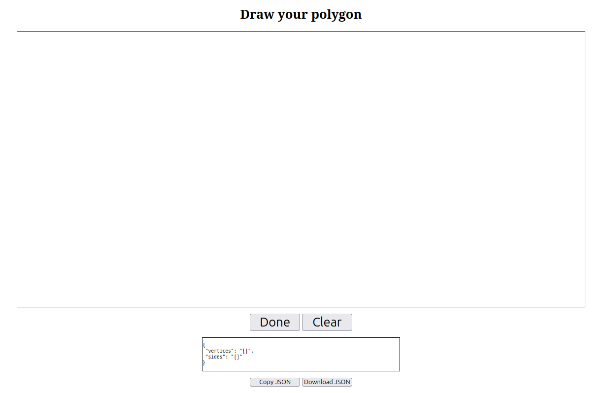

polygon-coordinates-generator is a simple, web based tool for generating polygons.

For another project I needed a quick and simple way of generating polygons defined by their vertices and the connections between them.
Since I also needed to learn some basic web development, I made this tool.

This tool is very basic, its made for generating this data and nothing more.
The tool may break on some situations since no testing was done.
This is intended in order to have a working tool and spend time in other bigger projects. 

### Usage

For launching the tool you simply need to open the `index.html` file on your browser.
No server or backend is required.

The tool is really simple, draw your polygon vertices clicking on the canvas.
Each vertex connects to the previous.
Once every vertex is defined, clicking the "Done" button will close the polygon and compile a JSON file with all the information.
Finally, you can copy or download the JSON and start again with the "Clear" button.

**IMPORTANT**: origin is the botton-left corner.

